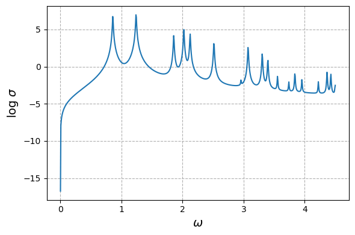

Tuto 6: Hybrid fermion-boson Hamiltonians: Hubbard-Holstein and
polaritonic chemistry
====================================================================

**Lucie Pepe - Laboratoire de Chimie Quantique de Strasbourg, France -
January 2024**

.. code:: ipython3

    # Import libraries 
    import numpy as np 
    import scipy 
    import matplotlib.pyplot as plt
    import quantnbody as qnb

In this second QuantNBody tutorial on hybrid models, we’ll show how to
build two simple examples of hybrid systems composed of fermions and
bosons interacting together.

Example 1: Hubbard-Holstein model
=================================

.. raw:: html

   

.. raw:: html

   

**Fermionic Hubbard model:**

In the local site basis, the Fermionic-Hubbard model Hamiltonian
:math:`\hat{H}_{elec}` is usually expressed such that:

.. math::

   \hat{H}_{elec} = {\sum_{\langle i,j \rangle}^{N_{MO}} -t_{ij} \sum_{\sigma=\uparrow,\downarrow} (\hat{a}^\dagger_{j,\sigma}\hat{a}_{i,\sigma}+\hat{a}^\dagger_{i,\sigma}\hat{a}_{j,\sigma})} + \color{black}{
   \sum_i^{N_{MO}} U_{iiii} \hat{a}^\dagger_{i,\uparrow}\hat{a}_{i,\uparrow} \hat{a}^\dagger_{i,\downarrow}\hat{a}_{i,\downarrow} 
   }

with:

| - :math:`t_{ij}` the hopping terms between the pair of connected
| sites :math:`\langle i, j \rangle`.

- :math:`U_{iiii}` the local coulombic repulsion on site “:math:`i`”.

**Adding the bosonic sub-part:**

.. math:: \hat{H}_{bos} = \sum_{s} \Omega_s \hat{b}^\dagger_{s} \hat{b}_{s}

with :math:`\Omega_s` the frequency of each mode :math:`s`, and
:math:`(\hat{b}^\dagger,\hat{b})` the bosonic operators.

**Adding the bosonic-fermionic interaction:**

.. math:: \hat{H}_{elec-bos} = \sum_{s} \lambda_s (\hat{b}^\dagger_{s} + \hat{b}_{s}) \sum_{\sigma=\uparrow,\downarrow}  \hat{a}^\dagger_{s,\sigma}\hat{a}_{s,\sigma}

with :math:`\lambda_s` the coupling of each mode :math:`s` with the
fermionic sub-system.

Step 1: Building the Hamiltonian
--------------------------------

If we choose the following number of constituants:

.. code:: ipython3

    # ======================================
    # Define the fermionic system
    # ======================================
    N_elec_Holstein = 2 # number of fermions 
    N_MO_Holstein   = 2 # number of molecular orbitals 
    
    # ======================================
    # Define the bosonic system
    # ======================================
    N_b_max_Holstein = 4 # maximal number of bosons in the whole bosonic system 
    N_mode_Holstein  = 2 # number of bosonic modes 
    list_bosons_Holstein = [ n for n in range(N_b_max_Holstein+1) ] # list of all possible number of bosons that can be distributed in the bosonic modes

One can directly use the implemented functions of the package to compute
the associated nbody-basis of the hybrid system, as described
previously:

.. code:: ipython3

    # ==============================================
    # Build the hybrid many-body basis and operators
    # ==============================================
    # Construct the basis 
    nbody_basis_Holstein = qnb.hybrid_fermionic_bosonic.tools.build_nbody_basis(N_mode_Holstein,
                                                                                list_bosons_Holstein,
                                                                                N_MO_Holstein,
                                                                                N_elec_Holstein)
    
    # Build the fermionic particle conserving operator 
    a_dagger_a_Holstein = qnb.hybrid_fermionic_bosonic.tools.build_fermion_operator_a_dagger_a(nbody_basis_Holstein,
                                                                                               N_mode_Holstein)
    
    # Build the bosonic creation (particle non-conserving) operator 
    b_Holstein = qnb.hybrid_fermionic_bosonic.tools.build_boson_anihilation_operator_b(nbody_basis_Holstein,
                                                                                       N_mode_Holstein)
    
    # Build the bosonic annhilation operator : hermitian conjugate of the bosonic creation (particle non-conserving) operator 
    b_dag_Holstein = []
    for mode in range(N_mode_Holstein):
        b_dag_Holstein += [b_Holstein[mode].T]

To obtain the whole Hamiltonian of the system, one has to use the
obtained operators and the expression of the global Hamiltonian. Let’s
first define all the parameters.

.. code:: ipython3

    # ====================
    # Define parameters
    # ====================
    t_val      = 1    # hopping term
    U_val      = 10   # local coulombic repulsion
    omega_val  = 10.0 # frequency, same for each mode
    lambda_val = 1.0  # coupling of each mode with the fermionic sub-system
    Coupling_fermion_boson = [lambda_val,lambda_val] # in a matrix form

The following step is the numerical computation of the one- and
two-electron integrals of the fermionic-Hubbard part of the system.

.. code:: ipython3

    # ======================
    # Fermionic Hamiltonian
    # ======================
    t_  = np.zeros((N_MO_Holstein,N_MO_Holstein))
    U_  = np.zeros((N_MO_Holstein,N_MO_Holstein,N_MO_Holstein,N_MO_Holstein)) 
    for i in range(N_MO_Holstein): 
        U_[i,i,i,i]  =  U_val  # Local coulombic repulsion 
        for j in range(i+1,N_MO_Holstein): 
            t_[i,j]  = t_[j,i] = - t_val  # Hopping constants
            
    # ====================================
    # Bosonic and interaction Hamiltonian
    # ====================================
    # Frequency of the modes in a matrix shape (here we have 2 modes)
    omega_values = [omega_val, omega_val]
    h_boson      = np.zeros((len(omega_values), len(omega_values)))
    np.fill_diagonal(h_boson, omega_values)

Nevertheless, this model is already implemented in the package. One can
just directly compute the whole Hamiltonian with the following line :

.. code:: ipython3

    H_Holstein = qnb.hybrid_fermionic_bosonic.tools.build_hamiltonian_hubbard_holstein( t_,
                                                                                        U_, 
                                                                                        a_dagger_a_Holstein,
                                                                                        h_boson,
                                                                                        b_Holstein,
                                                                                        Coupling_fermion_boson, 
                                                                                        nbody_basis_Holstein) 

Now we have the Hamiltonian, we can compute differentproperties of the
systems. Let’s take a look at some examples of what can be done!

Step 2: Computing time-independent observables
----------------------------------------------

**Ground state values:**

.. code:: ipython3

    # Simply diagonalize the Hamiltonian
    eig_energies_Holstein, eig_vectors_Holstein =  np.linalg.eigh(H_Holstein.A)
    print('Energies =', eig_energies_Holstein[:4] )

.. parsed-literal::

    Energies = [-0.58872733 -0.2        -0.2        -0.2       ]

We obtain here the groundstate energy and three subsequent degenerate
excited states energies.

**Occupation numbers:**

.. code:: ipython3

    # Compute the 2 bosonic occupation numbers in GS
    occ_number_mode1 = eig_vectors_Holstein[:,0].T @ b_dag_Holstein[0] @ b_Holstein[0] @ eig_vectors_Holstein[:,0]
    occ_number_mode2 = eig_vectors_Holstein[:,0].T @ b_dag_Holstein[1] @ b_Holstein[1] @ eig_vectors_Holstein[:,0]
    
    print('Occ bosonic mode 1 =', occ_number_mode1 )
    print('Occ bosonic mode 2 =', occ_number_mode2 )

.. parsed-literal::

    Occ bosonic mode 1 = 0.01008950475957189
    Occ bosonic mode 2 = 0.010089504759571898

**Visualizing the GS WF in the many-body-basis:**

.. code:: ipython3

    WFT_GS = eig_vectors_Holstein[:,0]
    WFT_visualize = qnb.hybrid_fermionic_bosonic.tools.visualize_wft(WFT_GS,
                                                                     nbody_basis_Holstein,
                                                                     N_mode_Holstein) 

.. parsed-literal::

    
    	-----------
    	 Coeff.     N-body state and index 
    	-------     ----------------------
    	-0.68715   |00⟩ ⊗ |1001⟩    #2 
    	+0.68715   |00⟩ ⊗ |0110⟩    #3 
    	-0.13356   |00⟩ ⊗ |0011⟩    #5 
    	-0.13356   |00⟩ ⊗ |1100⟩    #0 
    	+0.06871   |01⟩ ⊗ |1001⟩    #14 
    	+0.06871   |10⟩ ⊗ |1001⟩    #8 
    	-0.06871   |01⟩ ⊗ |0110⟩    #15 
    	-0.06871   |10⟩ ⊗ |0110⟩    #9 
    	+0.01995   |01⟩ ⊗ |0011⟩    #17 
    	+0.01995   |10⟩ ⊗ |1100⟩    #6 
    	-0.00683   |11⟩ ⊗ |1001⟩    #26 
    	+0.00683   |11⟩ ⊗ |0110⟩    #27 
    	+0.00676   |10⟩ ⊗ |0011⟩    #11 
    	+0.00676   |01⟩ ⊗ |1100⟩    #12 
    

Here we see that each state is decomposed as the tensor product of the
bosonic part (2 modes here with a different number of bosonic
occupancies, the maximum being 4 bosons) and a fermionic part (2 MOs
here, so 4 digits for the 4 associated spinorbitals, with always 2
fermions since the number of fermionic particles remains unchanged).

Step 3: Computing time-dependent observables
--------------------------------------------

Once all the components have been obtained, all the time-dependent
observables can be easily calculated. We need to calculate the evolution
operator for each time step and use it to compute the observables of
interest at each instant. As an example, we’ll concentrate here on the
occupancy number of each mode and fermionic molecular orbital.

.. code:: ipython3

    # ====================
    # Define parameters
    # ====================
    # Choose an initial state: a single hybrid configuration
    many_body_state = [2,2,1,1,0,0] # Let's put 2 bosons in each mode, and the 2 electrons in the first MO orbital.
    
    # Building the associated state in the qnb hybrid many-body basis  
    initial_state =  qnb.hybrid_fermionic_bosonic.tools.my_state( many_body_state,
                                                                  nbody_basis_Holstein)
    
    # Define time-dependent parameters
    Nb_points = 1000
    t_fin     = 1e2
    list_t    = np.linspace( start=0, stop=t_fin, num=Nb_points )

.. code:: ipython3

    # ==================================
    # Compute time-dependent populations
    # ==================================
    pops_modes = np.zeros(( Nb_points, len(nbody_basis_Holstein[0])), dtype=float)
    dim_H = len(nbody_basis_Holstein)
    for time_index in range(Nb_points):  
        
         # Building the evolution operator in the hybrid many-body basis 
         U = np.zeros((dim_H,dim_H),dtype=np.complex128)
         for k  in range(dim_H):
             U +=  np.exp( -1j * eig_energies_Holstein[k] * list_t[time_index] ) * np.outer( eig_vectors_Holstein[:,k],  eig_vectors_Holstein[:,k].conj())   
    
         # Determine the total wavefunction at each time step
         WF_T = U @ initial_state
    
         # Determine the occupation values in each site at each time-step
         for mode in range(len(nbody_basis_Holstein[0])):   
    
            if mode  <= N_mode_Holstein -1 :
                # bosonic modes
                pops_modes[time_index,mode] += (( np.conjugate(WF_T).T) @( b_dag_Holstein[mode].A @ b_Holstein[mode].A) @ WF_T ).real   
            else:
                # fermionic spin-orbitals
                pops_modes[time_index,mode] += (( np.conjugate(WF_T).T @ a_dagger_a_Holstein[mode- N_mode_Holstein,mode- N_mode_Holstein].A @ WF_T)).real

.. code:: ipython3

    # ==================================
    # Let's plot the results !
    # ==================================
    
    fig, (ax) = plt.subplots( nrows=2, ncols=1, figsize=(8, 6), sharex=(True) )
    
    # Bosonic population of the 2 local bosonic modes 
    ax[0].plot( list_t, pops_modes[:,0]  ,  color='yellow', label='1st bosonic mode')
    ax[0].plot( list_t, pops_modes[:,1] ,  color='black', label='2nd bosonic mode')
    ax[0].set_xlim(0, 70)
    ax[0].set_ylim(1.7, 2.1)
    ax[0].grid(ls='--')
    ax[0].legend(loc='upper right',fontsize='medium',  framealpha = 1 ) 
    ax[0].set_ylabel('Populations', size=14)
    ax[0].set_title('Population of bosonic modes', size=15)
    
    # Fermionic populations of the two MOs 
    ax[1].plot( list_t, np.sum(pops_modes[:,2:], axis=1) ,  color='black', ls='dotted', label='total')
    ax[1].plot( list_t, pops_modes[:,2] + pops_modes[:,3] ,  color='red', label='1st MO')  
    ax[1].plot( list_t, pops_modes[:,4] + pops_modes[:,5] ,  color='blue', label='2nd MO')  
    
    ax[1].set_xlim(0, 70)
    ax[1].set_ylim(-0., 2.1)
    ax[1].grid(ls='--')
    ax[1].legend(loc='upper right', fontsize='medium',  framealpha = 1 ) 
    ax[1].set_ylabel('Populations', size=14)
    ax[1].set_xlabel('Time ($t^{-1}$ unit) ', size=14)
    ax[1].set_title('Population of molecular orbitals', size=15)
    fig.tight_layout()

.. image:: output_21_0.png

Example 2: Polaritonic chemistry
================================

.. raw:: html

   

.. raw:: html

   

The QuantNBody package makes it possible to simulate polaritonic
chemistry: an electronic structure system (model or ab-initio) in
interaction with the photonic modes of a cavity. Here, as a proof of
principle, we’ll concentrate on reproducing the FCI (Full Configuration
Interaction) results obtained in the following article

`U. Mordovina et al., Phys. Rev. Res., 2, 023262
(2020) <https://journals.aps.org/prresearch/abstract/10.1103/PhysRevResearch.2.023262>`__.
For this reason, the molecular Hamiltonian here will be a fermi-Hubbard
Hamiltonian.

Let’s first define the parameters of the total Hamiltonian of the system
!

**Electronic (Fermi-Hubbard) Hamiltonian:**

.. math:: \hat{H}_{elec} = - t_0  \sum_{i\sigma} ( \hat{a}^\dagger_{i+1,\sigma} \hat{a}_{i \sigma}  + \hat{a}^\dagger_{i \sigma} \hat{a}_{i+1,\sigma} ) + U \sum_{i}   \hat{n}_{i,\uparrow}\hat{n}_{i,\downarrow}

With in the local site basis:
-:math:`\hat{n}_{i,\sigma} = \hat{a}^\dagger_{i\sigma}\hat{a}_{i\sigma}`
the density of a spin-:math:`\sigma` electron on site :math:`i`.
-:math:`t_0` and :math:`U` the usual hopping and on-site repulsion
constants. - The dipole operator of the system
:math:`\hat{d} =  \sum_i d_i ( \hat{n}_{i,\uparrow} + \hat{n}_{i,\downarrow} )`

**Cavity as a bosonic bath:**

.. math:: \hat{H}_{bos} =  \sum_{\alpha} \omega_{c,\alpha} \hat{b}^\dagger_{\alpha} \hat{b}_{\alpha}

Here, :math:`\hat{b}_{\alpha}` and :math:`\hat{b}^\dagger_{\alpha}`
represents the creation and annihilation operators for a cavity mode
with frequency :math:`\omega_{c,\alpha}`.

**Fermion-boson interaction:**

.. math:: \hat{H}_{elec-bos} =   \gamma_{\alpha} \omega_{c,\alpha} \hat{d} (\hat{b}^\dagger_{\alpha} + \hat{b}_{\alpha}) + \gamma_{\alpha}^2  \omega_{c,\alpha} \hat{d}^2

Here, the coupling parameter :math:`\gamma_{\alpha}` defines the
strength of the light-matter interaction; here we focus mostly on the
strong-coupling regime where :math:`\gamma_{\alpha}` > 0.05. Note that
in the following, every values will be expressed in :math:`t_0` units
(i.e., :math:`t_0 = 1`).

Step 1: Building the Hamiltonian
--------------------------------

As a proof-of-principle, we consider as in the reference paper `U.
Mordovina et al., Phys. Rev. Res., 2, 023262
(2020) <https://journals.aps.org/prresearch/abstract/10.1103/PhysRevResearch.2.023262>`__,
a half-filled four site Hubbard chain with an additional dipole coupled
to a single photon cavity mode with frequency
:math:`\omega_{c,\alpha}= 1.028`. Here we consider :math:`\gamma = 0.2`
for the light-matter coupling parameter, representing an ultrastrong
coupling.

.. code:: ipython3

    # ======================================
    # Define the fermionic system
    # ======================================
    N_elec_cavity = 4 # number of fermions 
    N_MO_cavity   = 4 # number of molecular orbitals 
    
    # ======================================
    # Define the bosonic system
    # ======================================
    N_b_max_cavity = 7 # maximal number of bosons in the whole bosonic system 
    N_mode_cavity  = 1 # number of bosonic modes 
    list_bosons_cavity = [ n for n in range(N_b_max_cavity+1) ] # list of all the possible occupation number values that a bosonic mode can take 
    
    # ======================================
    # Values of the parameters
    # ======================================
    U_val_cavity = 1     # on-site repulsion constant
    t_val_cavity = 0.5   # hopping constant
    gamma_cavity = 0.2   # coupling between bosons and fermions 
    freq_cavity  = 1.028 # cavity frequency 
    broad_cavity = 0.005 # broadening parameter for the GS absorption spectrum

Let’s now use the QuantNobdy functions to build the hybrid many-body
basis, the operators, and finally the whole Hamiltonian of the system.

.. code:: ipython3

    # ============================================================
    # Build the hybrid many-body basis, operators and Hamiltonian
    # ============================================================
    # Construct the basis 
    nbody_basis_total_cavity  = qnb.hybrid_fermionic_bosonic.tools.build_nbody_basis(N_mode_cavity,
                                                                                     list_bosons_cavity,
                                                                                     N_MO_cavity,
                                                                                     N_elec_cavity )
    dim_H_cavity = len(nbody_basis_total_cavity)
    
    # Build the fermionic particle conserving operator 
    a_dagger_a_cavity  = qnb.hybrid_fermionic_bosonic.tools.build_fermion_operator_a_dagger_a(nbody_basis_total_cavity, 
                                                                                              N_mode_cavity)
    
    # Build the bosonic creation (particle non-conserving) operator 
    b_cavity  = qnb.hybrid_fermionic_bosonic.tools.build_boson_anihilation_operator_b(nbody_basis_total_cavity,
                                                                                      N_mode_cavity)
    
    # Build the bosonic annhilation operator : hermitian conjugate of the bosonic creation operator 
    b_dag_cavity= []
    for mode in range(N_mode_cavity):
        b_dag_cavity += [b_cavity[mode].T]
    
    # Build the fermionic integrals
    t_cavity       = np.zeros((N_MO_cavity,N_MO_cavity))
    U_ferm_cavity  = np.zeros((N_MO_cavity,N_MO_cavity,N_MO_cavity,N_MO_cavity))
    for i in range(N_MO_cavity): 
        U_ferm_cavity[i,i,i,i]  =  U_val_cavity  # Local coulombic repulsion 
        for j in range(N_MO_cavity): 
            if j==i : 
                t_cavity[i,j] = 0 
            elif j==i+1 or j == i-1 :
                t_cavity[i,j] = t_cavity[j,i] = - t_val_cavity  
    
    # Building the dipole-related parameters  
    d_integrals = np.zeros((4,4), dtype = float)
    d_integrals[0,0] = -1.5
    d_integrals[1,1] = -0.5
    d_integrals[2,2] = 0.5
    d_integrals[3,3] = 1.5
    d_integrals = np.array(d_integrals)
    
    # Define them in a list for the implemented function of the QNB package 
    d_integrals_list    = np.diag(d_integrals)
    cut_off_integral    = 1e-8
    indices_d_integrals = np.transpose((abs(np.array(d_integrals))>cut_off_integral).nonzero())
    
    # Build the dipole operator
    d_op_cavity = scipy.sparse.csr_matrix((dim_H_cavity, dim_H_cavity)) 
    for indices in indices_d_integrals:
        p = indices[0]
        d_op_cavity +=  d_integrals[p,p] * (a_dagger_a_cavity[2*p,2*p] + a_dagger_a_cavity[2*p+1,2*p+1]) 
    
    # Build the total Hamiltonian 
    H_total_cavity  =  qnb.hybrid_fermionic_bosonic.tools.build_hamiltonian_hubbard_QED(t_cavity,
                                                                                        U_ferm_cavity, 
                                                                                        a_dagger_a_cavity, 
                                                                                        freq_cavity, 
                                                                                        gamma_cavity, 
                                                                                        d_integrals_list, 
                                                                                        b_cavity, 
                                                                                        nbody_basis_total_cavity)

Step 2: Computing time-independent properties
---------------------------------------------

Let’s now use all the previously calculated ingredients to find the FCI
values obtained in reference `U. Mordovina et al., Phys. Rev. Res., 2,
023262
(2020) <https://journals.aps.org/prresearch/abstract/10.1103/PhysRevResearch.2.023262>`__.

Here, we focus on the case of a half-filled four-site Hubbard chain with
an additional dipole coupled to a single photon cavity mode with
frequency :math:`\omega_{c,\alpha}= 1.028`. We consider here
:math:`\gamma= 0.2` for the light-matter coupling parameter,
representing ultra-strong coupling. For ultra-strong coupling, we have
considered that the maximum number of bosons would be
:math:`N_{B}^{max} = 7`. The values of the dipole in the site basis are
taken here as :math:`d=[-1.5,-0.5, 0.5, 1.5]`. All these parameters are
well defined in the legend of Table 1 (page 3) of `U. Mordovina et al.,
Phys. Rev. Res., 2, 023262
(2020) <https://journals.aps.org/prresearch/abstract/10.1103/PhysRevResearch.2.023262>`__.

**1) Ground state energies:**

All the FCI ground energies are available in Table 1 (page 3) of the
reference paper `U. Mordovina et al., Phys. Rev. Res., 2, 023262
(2020) <https://journals.aps.org/prresearch/abstract/10.1103/PhysRevResearch.2.023262>`__,
where different case of coupling (weak, strong, and ultrastrong) are
indicated. Here, it has been shown that the FCI value of the ground
state energy for the ultrastrong coupling (computed here as an example)
is -1.41864. Let’s calculate this value with the QuantNBody package, by
diagonalizing the Hamiltonian.

.. code:: ipython3

    eig_energies_cavity, eig_vectors_cavity =  np.linalg.eigh(H_total_cavity.A)
    print('Energies =', eig_energies_cavity[:4] )

.. parsed-literal::

    Energies = [-1.41864225 -1.02867613 -1.02867613 -1.02867613]

Energies = [-1.41864225 -1.02867613 -1.02867613 -1.02867613]

Here we find the FCI value of the reference `U. Mordovina et al., Phys.
Rev. Res., 2, 023262
(2020) <https://journals.aps.org/prresearch/abstract/10.1103/PhysRevResearch.2.023262>`__.
The ground state is followed by 3 degenerate excited states.

**2) Occupation number of the bosonic mode in the ground state:**

As for the ground state energies, All the FCI occupation numbers of the
bosonic mode of the cavity are available in Table 1 (page 3) of the
reference paper `U. Mordovina et al., Phys. Rev. Res., 2, 023262
(2020) <https://journals.aps.org/prresearch/abstract/10.1103/PhysRevResearch.2.023262>`__,
where different case of coupling (weak, strong, and ultrastrong) are
indicated. Here, it has been shown that the FCI value of the bosonic
mode occupation number for the ultrastrong coupling (computed here as an
example) is 8.69 × 10−3. Let’s calculate this value with the QuantNBody
package, using the computed :math:`\hat{b}` and :math:`\hat{b}^\dagger`
operators :

.. code:: ipython3

    occ_number_cavity = eig_vectors_cavity[:,0].T @ b_dag_cavity[0] @ b_cavity[0] @ eig_vectors_cavity[:,0]
    print('occ_number : ', occ_number_cavity)

.. parsed-literal::

    occ_number :  0.008692558807686325

Here we find again the FCI value of the FCI reference in `U. Mordovina
et al., Phys. Rev. Res., 2, 023262
(2020) <https://journals.aps.org/prresearch/abstract/10.1103/PhysRevResearch.2.023262>`__
with a great accuracy.

**3) Ground-state absorption spectrum:**

As defined in the Eq. 9 of the reference paper `U. Mordovina et al.,
Phys. Rev. Res., 2, 023262
(2020) <https://journals.aps.org/prresearch/abstract/10.1103/PhysRevResearch.2.023262>`__
(page 3), the matter absorption cross section is given by :

.. math:: \sigma(\omega) = 4 \pi \frac{\omega}{c} Im \left( \sum_k \frac{ | \langle \psi_k | \hat{d}| \psi_0  \rangle |^2 } {(\omega_k - \omega_0) - \omega - i \eta }     \right)

where :math:`|\psi_k \rangle` are many-body eigenstates of
:math:`\hat{H}` with energy :math:`\hbar \omega_k` , :math:`\omega` is
the frequency of incident light, and :math:`\eta= 0.005` is a (small)
broadening parameter accounting for the finite lifetime of the state.
Let’s compute the spectrum depicted in Fig 6.d of Appendix A (page 6) of
the reference paper for the ultrastrong coupling case, using the
parameters define in the related legend.

.. code:: ipython3

    # Make the frequency vary 
    freq_spec_list = np.linspace(1e-6,4.5,700)
    c = 1
    
    # Calculate the cross section
    cross_section = []
    for freq_spec in freq_spec_list:
        somme = 0
        for k in range(dim_H_cavity)  : 
            elem =  ((eig_vectors_cavity[:,k] @ d_op_cavity @ eig_vectors_cavity[:,0])**2.)   / ( (eig_energies_cavity[k] - eig_energies_cavity[0]) - freq_spec - 1j * broad_cavity  ) 
            somme += elem
        cross_section.append( 4* np.pi * ( freq_spec / c) * somme.imag)
    
    # Plotting 
    fig, ( bx ) = plt.subplots( nrows=1, ncols=1, figsize=(6, 4), sharex=(True) )
    bx.grid(linestyle='--')   
    
    bx.plot( freq_spec_list, np.log(cross_section) )  
    bx.set_ylabel('log $\\sigma$', size=14)
    bx.set_xlabel('$\\omega$', size=14) 
    plt.tight_layout() 
    plt.show()

Here, we obtain the exact same spectrum than in the reference paper `U.
Mordovina et al., Phys. Rev. Res., 2, 023262
(2020) <https://journals.aps.org/prresearch/abstract/10.1103/PhysRevResearch.2.023262>`__.
