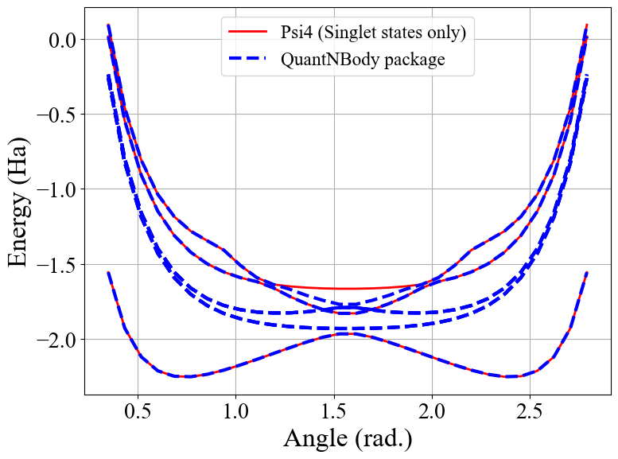
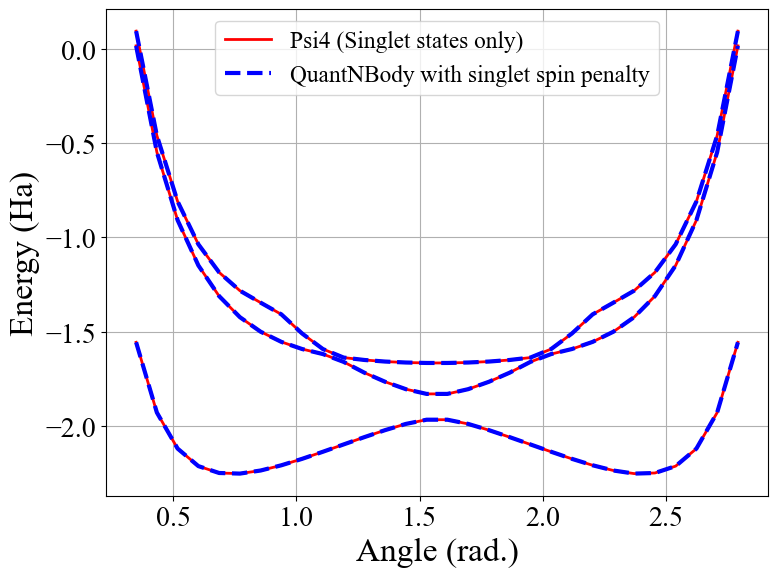

*Tuto 3:* electronic structure Hamiltonian and spin operators
============================================================================

**Dr. Saad Yalouz - Laboratoire de Chimie Quantique de Strasbourg,
France - July 2022**

In this QuantNBody tutorial, we will focus on the construction of spin
operators like :math:`S_2` and :math:`S_z` and *ab initio* electronic
structure Hamiltonians :math:`H`. We will show how easily we can build
these operators and use them.

Let us first import our package and some additional libraries

.. code:: ipython3

    import quantnbody as qnb
    import numpy as np
    import scipy
    import psi4
    import math

Electronic structure Hamiltonian
--------------------------------

The *ab initio* electronic structure Hamiltonian describes how a
collection of :math:`N_e` electrons rearrange around a set of positively
charged nuclei in a molecule. This operator is defined like:

.. math::  H = \sum_{p,q} h_{pq} {E}_{pq} + \frac{1}{2} \sum_{pqrs} g_{pqrs} {e}_{pqrs} + \mathcal{E}_{nuc.\ rep.}

where we have the one- and two-electron integrals :math:`h_{pq}` and
:math:`g_{pqrs}` (and the nuclear repulsion energy
:math:`\mathcal{E}_{nuc.\ rep.}`) associated to the one- and
two-electron spin-free excitation operators defined like

.. math::  {E}_{pq} = \sum_{\sigma=\uparrow,\downarrow} a^\dagger_{p,\sigma}a_{q,\sigma}

and

.. math::  e_{pqrs} = E_{pq}E_{rs} - \delta_{rs} E_{ps} .

Here again, we see that all these operators can be defined in terms of
the :math:`a_{p,\sigma}^\dagger a_{q,\tau}` operators.

Below, we show how to create such a Hamiltonian for the :math:`H_4`
molecule in the STO-3G basis, and how to (easily) compute a ground state
potential energy surface. In this case, we need to get access to the
electronic integrals of the system. We use for this Psi4 (but note that
Pyscf could have been used too !)

First we build the two essential ingredients: the many-body basis and :math:`a^\dagger a` operators

.. code:: ipython3

    N_elec = N_MO = 4 # Number of MOs and electrons in the system

    nbody_basis = qnb.fermionic.tools.build_nbody_basis( N_MO, N_elec )
    a_dagger_a  = qnb.fermionic.tools.build_operator_a_dagger_a( nbody_basis )

Then we can build the PES of the molecule with a loop

.. code:: ipython3

    def RUN_FCI_PSI4( string_geo, basisset, num_roots ):
        '''
        A function to run a FCI method with the Psi4 package
        '''
        psi4.geometry( string_geo )
        psi4.set_options({  'basis'       : basisset,
                            'num_roots'   : num_roots,
                            'S'           : 0.0,
                            'DIAG_METHOD' : 'SEM' })
        fci, fcici_wfn = psi4.energy('fci',return_wfn=True)

        E_FCI = []
        for root in range(num_roots):
            E_FCI += [ psi4.variable('CI ROOT {} TOTAL ENERGY'.format(root)) ]

        return E_FCI

    E_HF  = []
    E_FCI = []
    E_FCI_QNB = []

    N_elec   = N_MO = 4
    basisset = 'sto-3g'
    MAX_ROOT = 15
    list_theta = np.linspace(num = 30, start=20. * np.pi/180., stop=160. * np.pi/180., endpoint=True)

    dim_H  = math.comb( 2*N_MO, N_elec )
    nbody_basis = qnb.fermionic.tools.build_nbody_basis( N_MO, N_elec )

    dim_parameter = len(list_theta)
    Energies_FCI    = np.zeros((dim_parameter,MAX_ROOT))
    Energies_FCI_QNB = np.zeros((dim_parameter,dim_H))

    a_dagger_a  = qnb.fermionic.tools.build_operator_a_dagger_a(nbody_basis)
    S_2, S_z, S_plus =  qnb.fermionic.tools.build_s2_sz_splus_operator(a_dagger_a)
    # for r in tqdm(list_r):
    elem = 0
    for theta in (list_theta):
        r = 1.

        XYZ_geometry = """ H   {0}   {1}  0.
                           H   {0}  -{1}  0.
                           H  -{0}   {1}  0.
                           H  -{0}  -{1}  0.  """.format( r*np.cos(theta/2.), r*np.sin(theta/2.) )
        overlap_AO, h_AO, g_AO, C_RHF, E_HF, E_rep_nuc = qnb.fermionic.tools.get_info_from_psi4( XYZ_geometry,
                                                                                                 basisset )
        h_MO, g_MO = qnb.fermionic.tools.transform_1_2_body_tensors_in_new_basis( h_AO, g_AO, C_RHF )

        H           = qnb.fermionic.tools.build_hamiltonian_quantum_chemistry( h_MO,
                                                                               g_MO,
                                                                               nbody_basis,
                                                                               a_dagger_a )
        eig_energies, eig_vectors =  np.linalg.eigh( H.A )
        E_FCI_QNB += [ E_rep_nuc + eig_energies[0] ]
        Energies_FCI_QNB[elem,:] = [ E_rep_nuc + eig_energies[p]  for p in range(dim_H) ]
        Energies_FCI[elem,:] = RUN_FCI_PSI4( XYZ_geometry  + '\n' + 'symmetry c1', basisset, MAX_ROOT )

        elem += 1

Plotting the resulting :math:`H_4` PES
~~~~~~~~~~~~~~~~~~~~~~~~~~~~~~~~~~~~~~

.. code:: ipython3

    import matplotlib.pyplot as plt

    plt.rc('font',  family='serif')
    plt.rc('font',  serif='Times New Roman')
    plt.rc('font',  size='14')
    plt.rc('xtick', labelsize='x-large')
    plt.rc('ytick', labelsize='x-large')
    plt.rc('lines', linewidth='2')

    # Plotting the resulting energies
    fig, ( ax1 ) = plt.subplots( nrows=1, ncols=1, figsize=(8, 6)  )
    for i in range(3):
        if i ==0:
            ax1.plot( list_theta, Energies_FCI[:,i], color='red' , label='Psi4 (Singlet states only)' )
        else:
            ax1.plot( list_theta, Energies_FCI[:,i], color='red'   )
    for i in range(9):
        if i ==0:
            ax1.plot( list_theta, Energies_FCI_QNB[:,i], color='blue', ls='--', lw=3 , label='QuantNBody package'    )
        else:
            ax1.plot( list_theta, Energies_FCI_QNB[:,i], color='blue', ls='--', lw=3   )

    ax1.grid()
    ax1.set_ylabel('Energy (Ha)', size=24)
    ax1.set_xlabel('Angle (rad.)', size=24)
    ax1.legend(fontsize='large', ncol=1)

    plt.tight_layout()
    plt.show()

We see here that QuantNBody produces more states than Psi4 which is
restricted to singlets. This is linked to the spin symmetries which has
not been defined. As a results, we find here all the states including
singlet, triplet, quintet etc.

In the following we show how to build spin operators and restrict our
calculations to particular spin symmetries.

Building spin operators to check the spin symmetry of the states
----------------------------------------------------------------

With QuantNBdoy, one can easily build spin operators as the latter are
also naturally defined with :math:`a^\dagger a` elementary bricks. For
example, we can build the global :math:`{S}_2` operator

.. math::  {S}_2 = S_+ S_- + S_z(S_z-1) ,

and the :math:`S_z` contribution

.. math::  {S}_z =  \sum_p ( a^\dagger_{p,\alpha} a_{p,\alpha} - a^\dagger_{p,\beta} a_{p,\beta} ) ,

and the spin-up creation operator

.. math::  {S}_+ = \sum_p a^\dagger_{p,\alpha} a_{p,\beta}

as we know that :math:`{S}_- = {S}_+^\dagger`.

Below we show how to generate the matrix representation of these three
operators with a single pre-made function.

.. code:: ipython3

    S_2, S_z, S_plus =  qnb.fermionic.tools.build_s2_sz_splus_operator(a_dagger_a) # <=== FCT IN THE PACKAGE

Now, we can use the :math:`{S}_2` operator to check the spin
symmetry of the state produced by the QuantNBody. For this, nothing more
simple: we compute the averaged value of this operator for the 10 first
eigenstates of the *ab initio* Hamiltonian

.. math::  \langle {S}_2 \rangle_\Psi \equiv  \langle \Psi | {S}_2 | \Psi\rangle

We show how to do that below.

.. code:: ipython3

    print( 'Checking the value of S_2 for the 10 first eigenstates produced by QuantNBody ' )
    for i in range(10):
        print('Eigenstate #{} '.format(i) ,  eig_vectors[:,i].T @ S_2 @ eig_vectors[:,i])

.. code:: none

    Checking the value of S_2 for the 10 first eigenstates produced by QuantNBody
    Eigenstate #0  -9.28450747276484e-21
    Eigenstate #1  1.999999999999999
    Eigenstate #2  2.000000000000001
    Eigenstate #3  1.9999999999999984
    Eigenstate #4  1.9999999999999938
    Eigenstate #5  2.0000000000000018
    Eigenstate #6  2.000000000000003
    Eigenstate #7  8.535459286169437e-29
    Eigenstate #8  1.8794697497391845e-28
    Eigenstate #9  2.0000000000000004

Indeed ! We see here that the states generated are not all singlets,
e.g. from #1 to #6 we have triplets :/ …

To correct this, in QuantNBody we implemented a spin-penalty technique.
The idea is here to augment the Hamiltonian of a system like

.. math::  {H} \longrightarrow {H} + penalty \times ({S}_2 - s_2^{target})^2.

Redefining the Hamiltonian like this will change the spectrum of the
operator such that every eigenstates :math:`| \Psi \rangle` which don’t
have a specific spin symmetry such that

.. math::  \langle \Psi  | {S}_2 | \Psi \rangle = s_2^{target}

will take an “effective” positive energy penalty which will thus shift
the state upper in the spectrum. The penalty term is chosen to be
deliberatly large to ensure that these states are well discared. The
value of the spin symmetry targeted :math:`s_2^{target}` has to be
defined by the user.

This extension has been implemented for every fermionic Hamitlonian
(model or *ab initio* ones). We show below the additional arguments we
have to provide to the Hamiltonian function to generate this penalty
term and thus obtain singlet in :math:`H_4`.

.. code:: ipython3

    list_theta = np.linspace(num = 30, start=20. * np.pi/180., stop=160. * np.pi/180., endpoint=True)
    E_HF  = []
    E_FCI_me = []

    N_elec = N_MO = 4
    dim_H  = math.comb( 2*N_MO, N_elec )

    nbody_basis = qnb.fermionic.tools.build_nbody_basis( N_MO, N_elec )

    MAX_ROOT = 6

    dim_parameter = len(list_theta)
    Energies_FCI_QNB = np.zeros((dim_parameter,dim_H))

    a_dagger_a  = qnb.fermionic.tools.build_operator_a_dagger_a(nbody_basis)
    S_2, S_z, S_plus  =  qnb.fermionic.tools.build_s2_sz_splus_operator(a_dagger_a)
    # for r in tqdm(list_r):
    elem = 0
    for theta in (list_theta):
        r = 1.

        XYZ_geometry = """ H   {0}   {1}  0.
                           H   {0}  -{1}  0.
                           H  -{0}   {1}  0.
                           H  -{0}  -{1}  0.  """.format( r*np.cos(theta/2.), r*np.sin(theta/2.) )

        overlap_AO, h_AO, g_AO, C_RHF, E_HF, E_rep_nuc = qnb.fermionic.tools.get_info_from_psi4( XYZ_geometry,
                                                                                                 basisset )
        h_MO, g_MO = qnb.fermionic.tools.transform_1_2_body_tensors_in_new_basis( h_AO, g_AO, C_RHF )

        H           = qnb.fermionic.tools.build_hamiltonian_quantum_chemistry( h_MO,
                                                                       g_MO,
                                                                       nbody_basis,
                                                                       a_dagger_a,
                                                                       S_2 = S_2,    # <=== Here : S_2 operator
                                                                       S_2_target=0) # <=== Here : spin symmetry targeted
        eig_energies, eig_vectors =  np.linalg.eigh( H.A )
        E_FCI_me += [ E_rep_nuc + eig_energies[0] ]
        Energies_FCI_QNB[elem,:] = [ E_rep_nuc + eig_energies[p]  for p in range(dim_H) ]

        elem += 1

Plotting the spin corrected :math:`H_4` PES
~~~~~~~~~~~~~~~~~~~~~~~~~~~~~~~~~~~~~~~~~~~~~~
.. code:: ipython3

    import matplotlib.pyplot as plt

    plt.rc('font',  family='serif')
    plt.rc('font',  serif='Times New Roman')
    plt.rc('font',  size='14')
    plt.rc('xtick', labelsize='x-large')
    plt.rc('ytick', labelsize='x-large')
    plt.rc('lines', linewidth='2')

    # Plotting the resulting energies
    fig, ( ax1 ) = plt.subplots( nrows=1, ncols=1, figsize=(8, 6)  )
    for i in range(3):
        if i ==0:
            ax1.plot( list_theta, Energies_FCI[:,i], color='red' , label='Psi4 (Singlet states only)' )
        else:
            ax1.plot( list_theta, Energies_FCI[:,i], color='red'   )
    for i in range(3):
        if i ==0:
            ax1.plot( list_theta, Energies_FCI_QNB[:,i], color='blue', ls='--' , lw=3, label='QuantNBody with singlet spin penalty'    )
        else:
            ax1.plot( list_theta, Energies_FCI_QNB[:,i], color='blue', ls='--' , lw=3  )

    ax1.grid()

    ax1.set_ylabel('Energy (Ha)', size=24)
    ax1.set_xlabel('Angle (rad.)', size=24)
    ax1.legend(fontsize='large', ncol=1)

    plt.tight_layout()

    plt.show()

Congrats ! Here we have totally solved the problem: the lowest
eigenstates given by our code are indeed singlet ! To check this we can
compute again the averaged :math:`\langle S_2 \rangle` over the few
first eigenstates as shown below.

.. code:: ipython3

    print( 'Checking the value of S_2 for the 10 first eigenstates produced by QuantNBody ' )
    for i in range(10):
        print('Eigenstate #{} '.format(i) ,  eig_vectors[:,i].T @ S_2 @ eig_vectors[:,i])

.. code:: none

    Checking the value of S_2 for the 10 first eigenstates produced by QuantNBody
    Eigenstate #0  7.211422253675881e-35
    Eigenstate #1  2.4220494982141283e-30
    Eigenstate #2  3.585503779835195e-30
    Eigenstate #3  4.118252264590018e-30
    Eigenstate #4  5.66521922848957e-30
    Eigenstate #5  -1.3764367007004992e-17
    Eigenstate #6  -3.441433200150141e-17
    Eigenstate #7  3.386030493767104e-30
    Eigenstate #8  1.243288016307383e-17
    Eigenstate #9  5.035284097980329e-30
